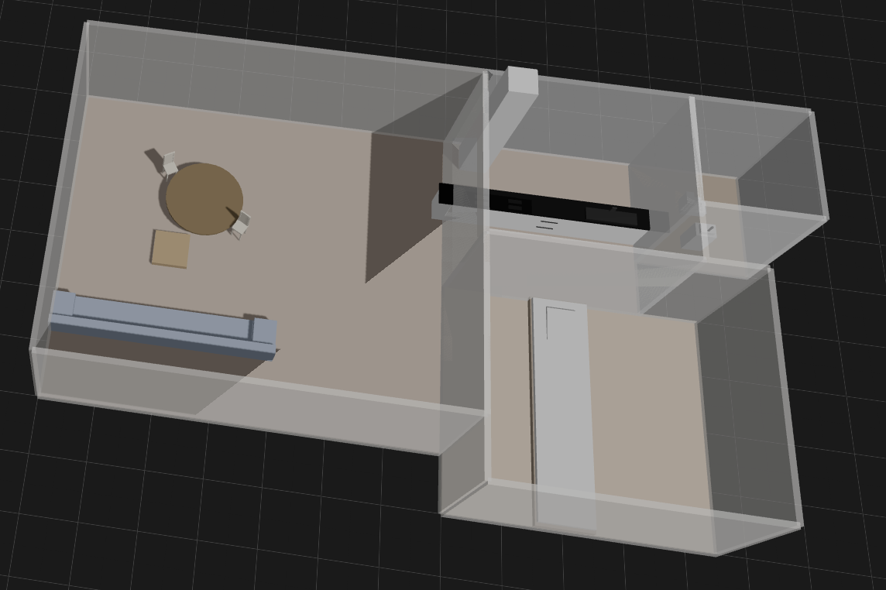
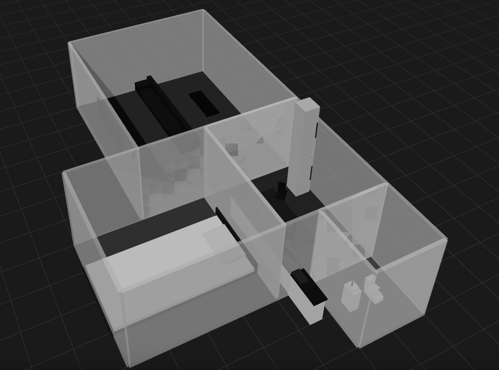
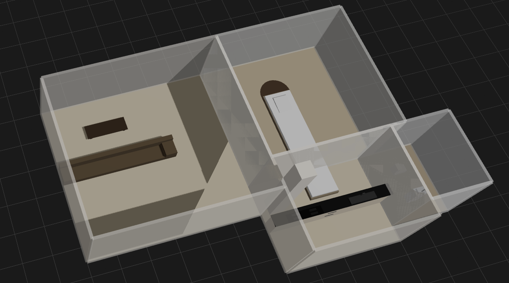
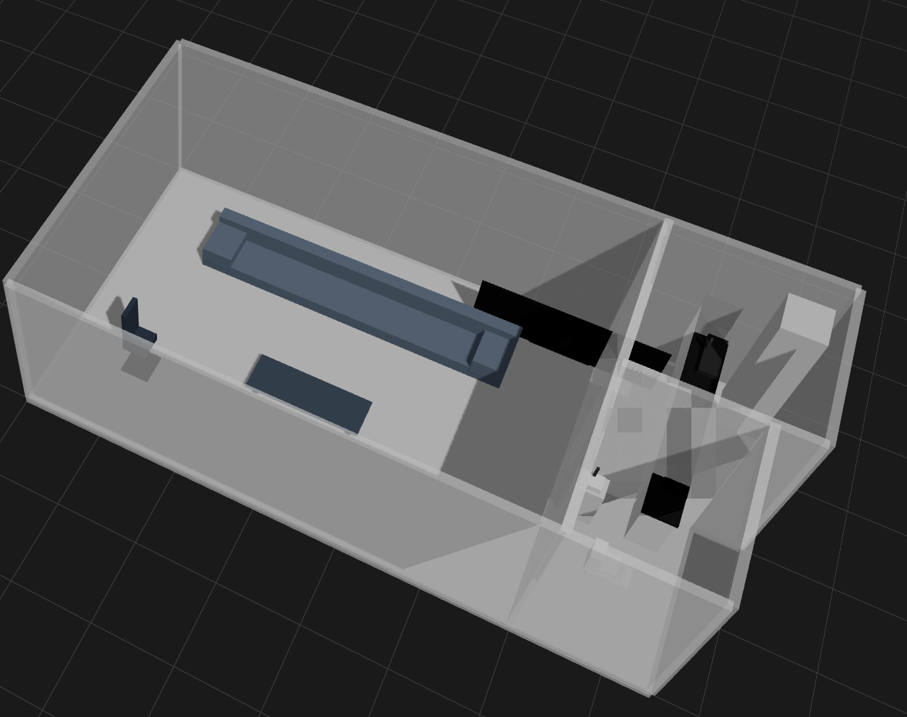

# 3D Demo: Anti-Gravity Houses

## サイトのタイトル
**Anti-Gravity Houses: 3D Demo**

## サイトの内容
このサイトでは、3D技術を活用して「北欧ハウス」「モダンハウス」「和モダンハウス」「コンパクトハウス」の4種類の家を展示しています。それぞれの家は、独自のデザインとレイアウトを持ち、3D空間で自由に閲覧することができます。

### サンプルレイアウト画像
#### 北欧ハウス


#### モダンハウス


#### 和モダンハウス


#### コンパクトハウス


## 起動方法
1. 必要な依存関係をインストールします。
    ```bash
    npm install
    ```
2. サーバーを起動します。
    ```bash
    npm start
    ```
3. ブラウザで以下のURLにアクセスします。
    ```
    http://localhost:3000
    ```

## 注意事項
- サンプル画像は `./images/` ディレクトリに配置してください。
- Node.js と npm がインストールされていることを確認してください。
- 以下のパッケージが必要です。インストールされていない場合は、手順1の前にインストールしてください。
    - `three` (3Dレンダリングライブラリ)
    - `dat.gui` (GUIコントローラー)
    - `stats.js` (パフォーマンスモニタリング)
    ```bash
    npm install three dat.gui stats.js
    ```